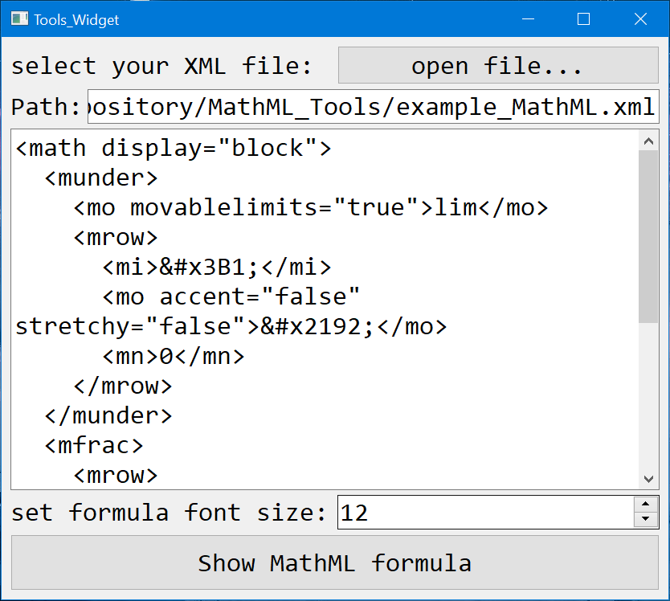

# MathML_Tools

Usage

* run `MathML_Tools.exe`.
* Select your MathML xml file or input word using MathML language.
* Click `Show MathML formula` button.
* Enjoy.

helps

- 
- 
- 
- 

使用说明

* 运行程序 `MathML_Tools.exe`。
* 选择 `MathML` 格式的xml文件，或者输入路径自动读入至编辑器内。
* 或者直接在编辑器内输入 `MathML` 格式段。
* 点击 `Show MathML formula` 按钮（格式正确按钮才能点击）。
* 帮助文档：[在线LaTeX公式编辑器-帮助文档 (latexlive.com)](https://www.latexlive.com/help)
